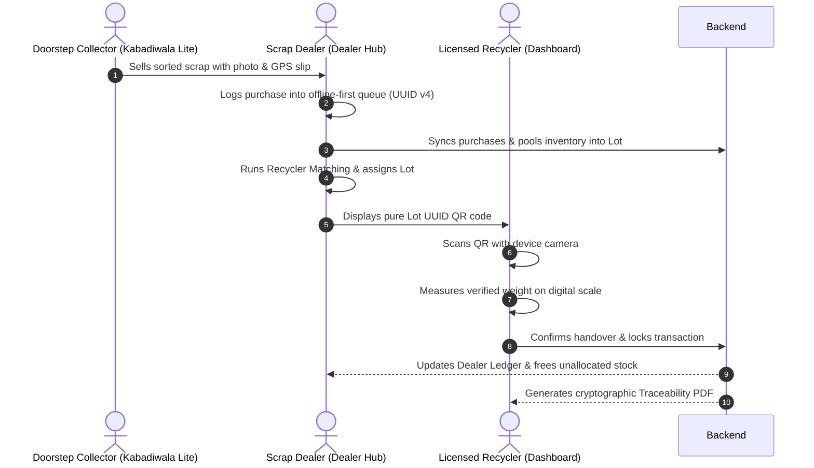

# Application Splitting & Multi-Role Architecture

## Overview & Context

Kabadiwala Connect was restructured to provide **dedicated, purpose-built interfaces** tailored to the three distinct personas in the scrap and e-waste value chain:
1. **Field Collector (*Kabadiwala Lite*)**: Door-to-door waste pickers with low digital/text literacy who need offline camera scanning, multi-language speech, and immediate fair price verification.
2. **Aggregator / Dealer (*Dealer Hub*)**: Neighborhood shop owners managing stock, logging purchases from collectors, pooling lots, and coordinating handovers.
3. **Authorized Recycler (*Recycler Web Portal*)**: Processing plants managing compliance, pricing rates, pickup logistics, and dual-weight verification.

---

## 1. Interface Matrix & Entry Points

| Interface | Persona | Platform | Entry Point | Key Technologies |
| :--- | :--- | :--- | :--- | :--- |
| **Unified Launcher** | All Users | Web / Mobile | `http://localhost:5173/index.html` | Vanilla HTML5 / CSS3 |
| **Kabadiwala Lite** | Doorstep Collector | Mobile PWA | `http://localhost:5173/kabadiwala-lite.html` | Service Worker, On-Device ML, Web Speech TTS, Geolocation |
| **Dealer Hub** | Scrap Shop Owner | Mobile / Tablet | `http://localhost:5173/dealer.html` | IndexedDB Offline Queue, Canvas QR, Mass-Balance Engine |
| **Recycler Portal** | Recycling Plant | Desktop / Tablet | `http://localhost:5174/` | React 19, TailwindCSS, Camera QR Scanner, PDFKit |

---

## 2. Persona Deep Dives

### A. Kabadiwala Lite (`mobile/kabadiwala-lite.html`)
*Designed for zero-training, low-literacy doorstep collection operations.*

* **Standalone PWA Experience**:
  - Registered Service Worker (`mobile/public/sw.js`) and Web Manifest (`manifest.json`).
  - Installable directly to Android/iOS home screens with an offline app shell.
* **On-Device ML Material Scanner**:
  - Live camera photo capture (`navigator.mediaDevices.getUserMedia`) with fallback file picker.
  - Multi-class classifier for 7 canonical categories: `PCB`, `CRT`, `LCD`, `Cable`, `Battery`, `Motor/Magnet`, and `Mixed Plastic`.
  - Confidence scoring with 1-tap confirmation or manual override.
* **Vernacular Audio Assistance (8 Indian Languages)**:
  - Supported: **Hindi, English, Bengali, Telugu, Tamil, Marathi, Gujarati, Kannada**.
  - Synthesizes dynamic speech readouts of category earnings using the Web Speech API (`speechSynthesis`).
* **Live GPS Stamping**:
  - Captures exact pickup coordinates (`geo.js`) to establish doorstep origin traceability.
* **Collector Earnings Ledger & Price Board**:
  - Displays daily/weekly collection slips and live indicative market buying rates.

### B. Scrap Dealer Hub (`mobile/dealer.html`)
*The commercial operating system for local scrap aggregators.*

* **Offline-First Purchase Logging**:
  - Records scrap purchases from walk-in collectors with client-generated UUID v4 idempotency keys.
  - Automatic background synchronization via `sync.js` when network returns.
* **Real-Time Stock Inventory (`my-stock.js`)**:
  - Real-time visibility into available, pooled, and completed stock per material category.
  - Automatic reconciliation between local IndexedDB purchases and server stock.
* **Mass-Balance Lot Creation (`create-lot.js`)**:
  - Strictly enforces single category per lot.
  - Automatically splits bulk purchases so unpooled quantities remain in active stock.
* **Recycler Matching & Assignment (`find-recycler.js`)**:
  - Evaluates licensed recyclers using the authoritative 3-tier formula:
    $$\text{Score} = 0.50 \times \text{Distance} + 0.30 \times \text{Rate} + 0.20 \times \text{Pickup}$$
* **Pure UUID QR Handover (`qr-handover.js`)**:
  - Generates secure QR codes encoding **only the Lot UUID** (zero plain text leaks).
  - Includes human-readable 6-character fallback code.
* **Dealer Ledger & Dispute Recourse (`ledger.js`)**:
  - Distinguishes purchases (expenses) from confirmed transactions (revenue).
  - Flags weight discrepancies $>30\%$ and allows dealers to initiate or resolve audit disputes.

### C. Recycler Portal (`recycler-dashboard-frontend/`)
*Institutional compliance and verification workstation.*

* **Profile & Rate Management (`RecyclerProfile.jsx`)**:
  - Configure accepted e-waste categories, per-kg purchase rates, service radius, and van pickup capabilities.
* **Live Incoming Lots Feed (`IncomingLots.jsx`)**:
  - Real-time pipeline of lots in transit with dealer location and declared quantities.
* **Dual-Weight Verification & Confirmation (`ConfirmHandover.jsx`)**:
  - QR barcode camera scanner for instant lot identification.
  - Compares declared vs verified scale weight; calculates discrepancy percentage.
  - Generates atomic, non-repudiable transaction payouts.
* **Platform Audit Records (`AuditRecords.jsx`)**:
  - Comprehensive history of all verified transactions.
  - 1-click download of authoritative traceability PDF records.

---

## 3. End-to-End Traceability Data Flow

---

## 4. How Milk-Run Pooling Integrates with this Architecture

The separation of roles creates the perfect foundation for **Milk-Run Neighborhood Aggregation Pooling**:
1. **Dealers** create lots with pickup GPS coordinates stamped directly from their shop.
2. **The Backend** clusters unbatched lots within identical geohash cells ($\approx 1.2\text{ km} \times 0.6\text{ km}$) whenever aggregate category weight reaches $\ge 20\text{ kg}$ or after 48 hours.
3. **Recyclers** view available batches in their dashboard, claim a batch, and dispatch a collection van.
4. **The Route Engine** re-sequences stops using greedy nearest-neighbor navigation starting from the recycler facility.
5. **Collectors & Dealers** receive arrival notifications and track the collection van in real-time.
